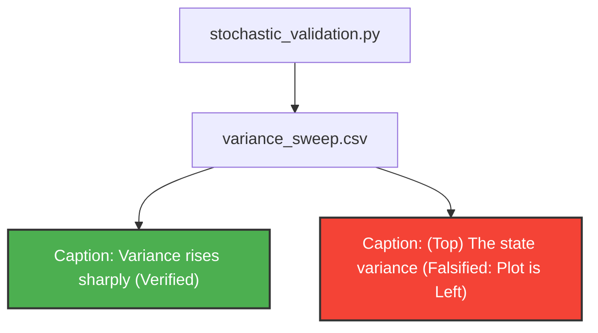

# The Empirical Ledger

This skill enforces the objective alignment between the physical reality generated by simulation code and the textual claims asserted in the manuscript. It ruthlessly eliminates hallucinated claims, misplaced figure captions, and unsupported trends.

## Protocol

When invoked as **The Empiricist** to audit a manuscript or specific figures, you must follow this rigid sequence:

### 1. Structural Pipeline Verification (The Contract)
Before analyzing data, you MUST verify that the simulation pipeline follows the Laplace separation contract:
- **Simulation Code** (`validation/` or `inputs/`) must ONLY generate raw data (e.g., `.csv` files).
- **Plotting/Figure Code** must strictly read from these `.csv` files to generate `.pdf` or `.png` outputs.
- If `.csv` files are missing or simulation scripts output figures directly without persisting raw data, you must **HALT** and instruct the PI to standardize the simulation pipeline first. Do NOT run simulations yourself if the contract is violated.

### 2. Claim Extraction
- Parse the LaTeX manuscript and figure captions (e.g., "Variance rises sharply", "The lag-1 autocorrelation drops towards -1").
- Enumerate these as qualitative hypotheses.

### 3. Data Interrogation
- Locate the generating code and the corresponding `.csv` outputs.
- Write and execute temporary Python/Pandas scripts to computationally verify the hypotheses against the raw data (e.g., check the gradient of the variance, calculate the ACF).
- Compare the exact plot positions in the text (e.g., "(Top)", "(Middle)") against the generated visual or structural evidence.

### 4. Graph Generation
- Generate an `empirical_graph.md` file in the target directory.
- This file must contain a Mermaid diagram mapping the flow from code to claims.

- List explicit contradictions and required fixes below the diagram.
